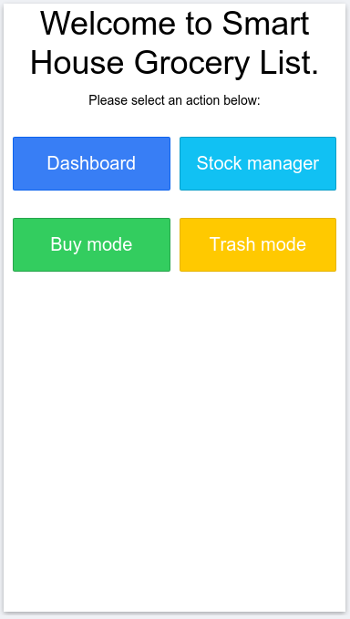
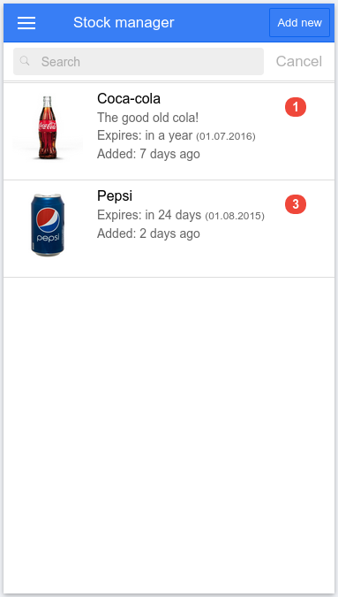
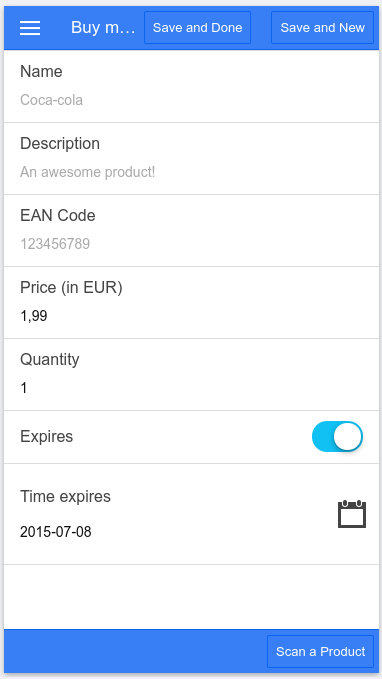
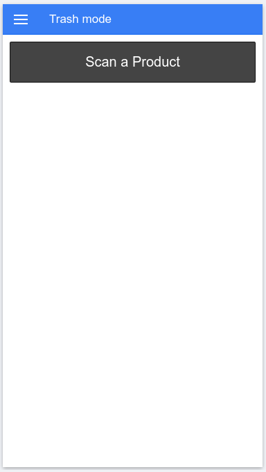

Smart House Grocery List
========
Just a simple groceries management (mobile) application, build upon ionic.

Getting started
--------
* `npm install ionic cordova` (if you haven't already)
* `git clone https://github.com/bobalazek/smart-house-grocery-list-mobile && cd _$`
* `ionic serve`
* Done!

Preview
----------------------
Logically, it's not the final design yet. Just previews!

### Home View ###

### Stock Manager View ###

### Buy Mode View ###

### Trash Mode View ###

License
--------
Smart House Grocery List (Mobile) is licensed under the MIT License
